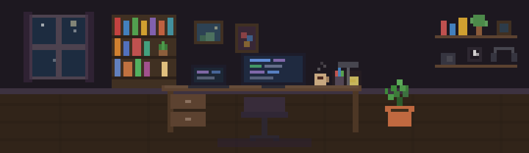

## 👋 Introduction

<!-- Typing SVG -->

<!-- Banner — commit banner.svg to your profile repo root -->

  

<!-- Profile GIF -->

Hi there! I'm **PolPol**, a Beginner Fullstack Developer from Thailand 🇹🇭  
I'm passionate about crafting clean, scalable, and user-friendly web applications.  
I mainly work with **Laravel**, **Angular**, and **Docker**, and I love learning new things.

> 🧠 “Make it simple, but significant.”

---

## 🚀 Tech Stack

- 🧩 Frontend: `Angular`, `Bootstrap`, `Tailwind CSS`, `ReactJs` , `NuxtJs` , `NextJs`
- ⚙️ Backend: `Laravel`, `PHP`, `MySQL`, `REST API` , `NextJs`
- 🧰 Tools: `Docker`, `Postman`, `Git`, `VS Code` , `Bruno`
- 🔭 Currently exploring: `TypeScript`, `CI/CD` , `Python` , `Rust` , `Ruby` 

---

## 🐍 Snake Animation

