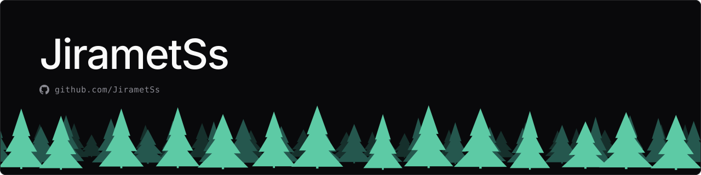

##  Introduction

  

Hi there! I'm **PolPol**, a Beginner Fullstack Developer from Thailand   
I'm passionate about crafting clean, scalable, and user-friendly web applications.  
I mainly work with **Laravel**, **Angular**, and **Docker**, and I love learning new things.

>  “Make it simple, but significant.”

### Tech stack

**Frontend**  

**Backend**  

**Tools**  

**Exploring**  

##  Snake Animation

